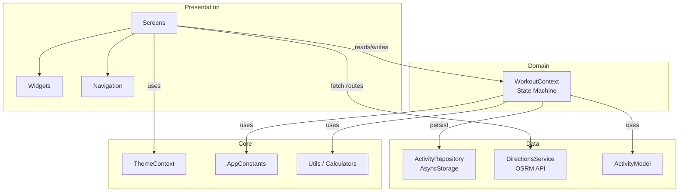
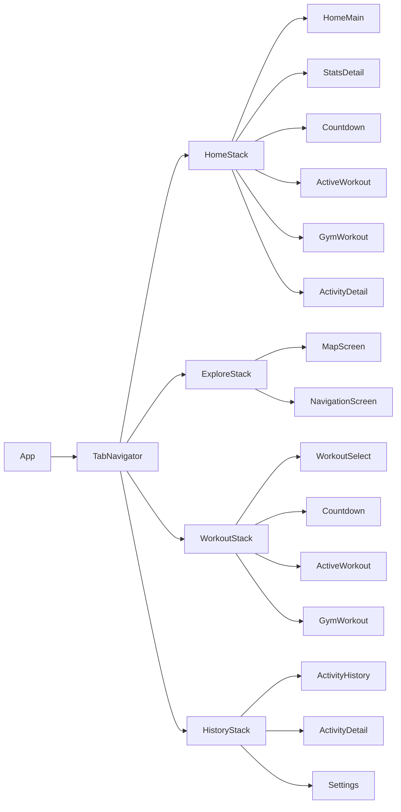
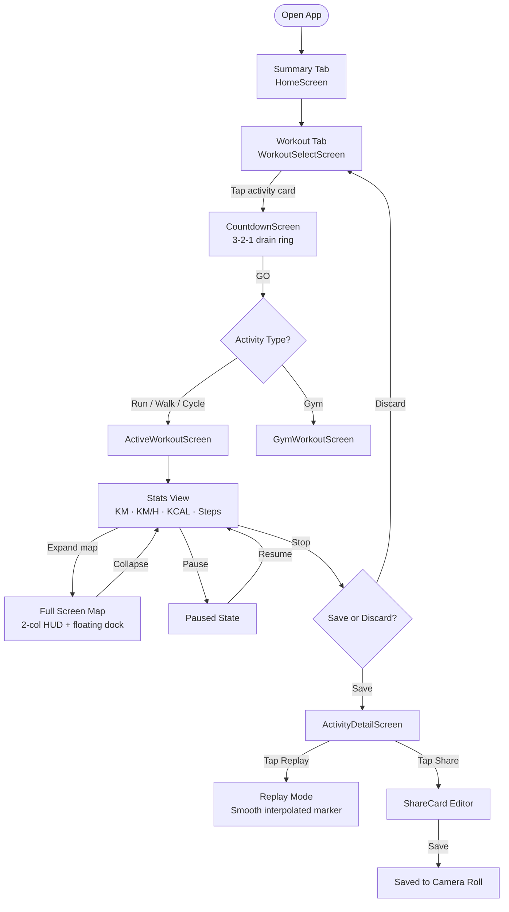
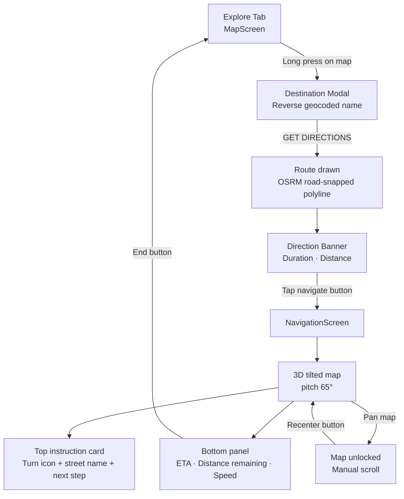
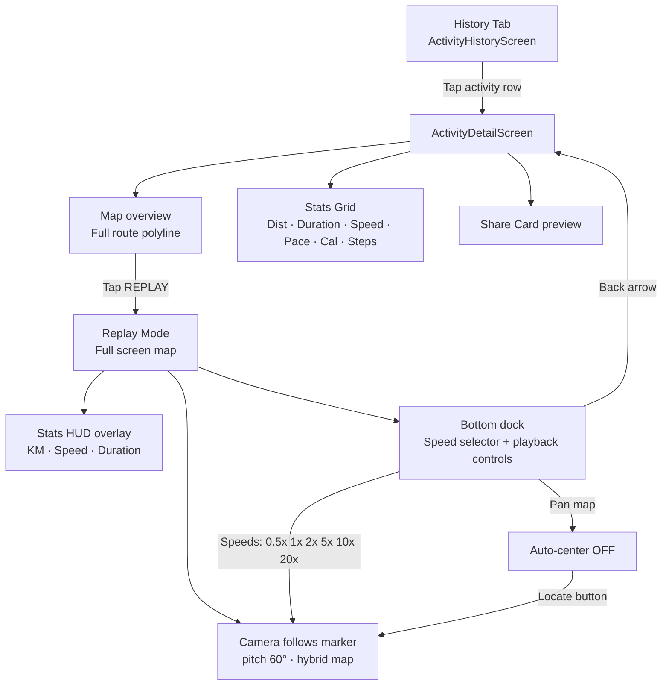
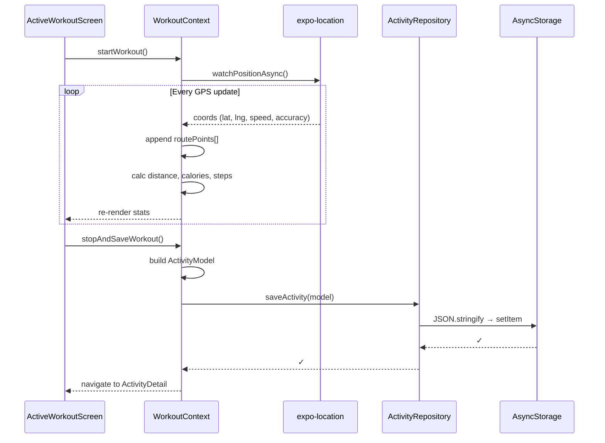

# StriveApp

> An Apple Fitness-inspired workout tracking app built with **React Native / Expo SDK 54**.  
> GPS tracking, turn-by-turn navigation, route replay, activity history, and share cards — all in one app.

---

## Table of Contents

- [Overview](#overview)
- [Tech Stack](#tech-stack)
- [Project Structure](#project-structure)
- [Architecture](#architecture)
- [Navigation Flow](#navigation-flow)
- [Screen Flow Diagrams](#screen-flow-diagrams)
  - [Workout Flow](#workout-flow)
  - [Explore / Navigation Flow](#explore--navigation-flow)
  - [History & Replay Flow](#history--replay-flow)
- [Data Flow](#data-flow)
- [Key Features](#key-features)
- [Getting Started](#getting-started)
- [Dependencies](#dependencies)

---

## Overview

StriveApp is a fitness tracking mobile app for iOS, designed to closely mirror the Apple Fitness app experience. It tracks outdoor workouts (run, walk, cycle) and gym sessions with live GPS, real-time stats, route replay, and a turn-by-turn navigation mode for exploring routes.

---

## Tech Stack

| Layer | Technology |
|---|---|
| Framework | React Native 0.77 + Expo SDK 54 |
| Navigation | React Navigation v7 (Native Stack + Bottom Tabs) |
| Maps | react-native-maps (Apple Maps / PROVIDER_DEFAULT) |
| Location | expo-location |
| Directions API | OSRM (Open Source Routing Machine) |
| Storage | AsyncStorage |
| Graphics | react-native-svg, expo-linear-gradient |
| Media | expo-av (video), expo-media-library |
| Haptics | expo-haptics |
| Build | EAS Build (Expo Application Services) |

---

## Project Structure

```
StriveApp/
├── App.js                          # Root component, context providers
├── index.js                        # Entry point
├── app.json                        # Expo config (bundle ID, permissions, plugins)
├── eas.json                        # EAS Build profiles
├── CHANGELOG.md
├── assets/
│   ├── running.mp4                 # Activity video icon
│   ├── walking.mp4
│   └── bike.mp4
└── src/
    ├── core/                       # Shared utilities & constants
    │   ├── constants/
    │   │   └── appConstants.js     # WORKOUT_TYPES, WORKOUT_STATES, etc.
    │   ├── theme/
    │   │   ├── ThemeContext.js     # Dark/light mode + glass design mode
    │   │   └── colors.js           # Color palette
    │   └── utils/
    │       └── distanceCalculator.js  # Haversine, pace, duration formatters
    │
    ├── data/                       # Data layer
    │   ├── models/
    │   │   └── ActivityModel.js    # Activity data shape & factory
    │   ├── repositories/
    │   │   └── activityRepository.js  # AsyncStorage CRUD for activities
    │   └── services/
    │       └── directionsService.js   # OSRM API calls, route parsing
    │
    ├── domain/                     # Business logic
    │   └── providers/
    │       └── WorkoutContext.js   # Workout state machine, GPS, history
    │
    └── presentation/               # UI layer
        ├── navigation/
        │   └── AppNavigator.js     # Tab + Stack navigator setup
        ├── screens/
        │   ├── HomeScreen.js       # Summary dashboard
        │   ├── StatsDetailScreen.js
        │   ├── MapScreen.js        # Explore + directions
        │   ├── NavigationScreen.js # Turn-by-turn navigation
        │   ├── WorkoutSelectScreen.js
        │   ├── CountdownScreen.js  # 3-2-1 countdown
        │   ├── ActiveWorkoutScreen.js
        │   ├── GymWorkoutScreen.js
        │   ├── ActivityHistoryScreen.js
        │   ├── ActivityDetailScreen.js  # Replay screen
        │   └── SettingsScreen.js
        └── widgets/
            ├── CustomTabBar.js     # BlurView tab bar with animations
            ├── GlassCard.js        # Gradient card component
            ├── ShareCard.js        # Share card editor/exporter
            ├── WeeklySummary.js
            └── FeedCard.js
```

---

## Architecture

StriveApp follows a **4-tier N-layer architecture**:



### Layer Responsibilities

| Layer | Responsibility |
|---|---|
| **Core** | Constants, theme, utility functions. No dependencies on other layers. |
| **Data** | ActivityModel schema, AsyncStorage repository, OSRM directions service. |
| **Domain** | `WorkoutContext` — GPS tracking, workout state machine (idle → active → paused → saved), history management. |
| **Presentation** | All screens, widgets, and navigation. Consumes Domain via React Context. |

---

## Navigation Flow



> **Tab bar hides** on: `ActiveWorkout`, `GymWorkout`, `ActivityDetail`, `StatsDetail`, `NavigationScreen`, `CountdownScreen`

---

## Screen Flow Diagrams

### Workout Flow



### Explore / Navigation Flow



### History & Replay Flow



---

## Data Flow



---

## Key Features

### Summary Tab
- Activity Ring (SVG) — green progress showing daily calorie goal
- Step Count & Distance cards with mini bar charts
- Sessions & Duration totals
- Recent activity list with map thumbnails
- Tappable cards → StatsDetailScreen (D/W/M/Y periods)

### Explore Tab
- Apple Maps with dark/light/hybrid/satellite modes
- Long-press to set a destination (reverse geocoded)
- OSRM road-snapped directions
- Dedicated `NavigationScreen` with:
  - 3D tilted camera following navigation puck
  - Turn-by-turn instructions (icon + text + next step preview)
  - ETA, remaining distance, current speed
  - Route snapping — forward-only, no jumping

### Workout Tab
- Select: Outdoor Walk, Run, Cycle, Strength Training
- MP4 video thumbnails as circular activity icons
- **3-2-1 Countdown** (single draining ring, Apple Fitness style)
- Live GPS stats: KM, KM/H, ACTIVE KCAL, TOTAL KCAL, STEPS
- Mini map (3D tilt) with expand → full screen
- Full-screen map with 2-column HUD + floating control dock
- Pause / Resume / Stop + Save

### History Tab
- Full activity list with type, distance, duration, calories
- Tap → ActivityDetailScreen
- **Route Replay** with smooth interpolated marker (5 sub-points per segment)
- Speed selector (0.5×–20×), playback controls (restart/rewind/play/forward)
- Share Card editor → save PNG to Camera Roll

### Design System
- `GlassCard` — LinearGradient background (silver-top → dark-bottom)
- `CustomTabBar` — BlurView background, animated green highlight, glow border on switch
- `ThemeContext` — dark/light mode + glass design modes (Solid/Clear/Tinted), persisted to AsyncStorage

---

## Getting Started

### Prerequisites
- Node.js 18+
- Expo CLI: `npm install -g expo-cli`
- Expo Go app on iPhone (iOS 16+)

### Run locally

```bash
git clone https://github.com/JZDG/StriveAppJZDG.git
cd StriveAppJZDG
npm install
npx expo start
```

Scan the QR code with the **Expo Go** app on your iPhone.

### EAS Build (iOS)

```bash
npm install -g eas-cli
eas login
eas build --platform ios --profile development
```

> Requires an **Apple Developer account** ($99/year) for device builds.

---

## Dependencies

| Package | Version | Purpose |
|---|---|---|
| expo | ~54.0.0 | Core SDK |
| react-native | 0.77.1 | Framework |
| react-native-maps | 1.20.1 | Apple Maps integration |
| expo-location | ~19.0.8 | GPS tracking |
| expo-av | ~16.0.8 | MP4 video playback |
| expo-blur | ~15.0.8 | BlurView (tab bar, nav card) |
| expo-linear-gradient | ~15.0.8 | GlassCard backgrounds |
| expo-haptics | ~15.0.8 | Tactile feedback |
| expo-media-library | ~18.2.1 | Save share cards to gallery |
| expo-image-picker | ~17.0.11 | Share card image background |
| expo-sensors | ~15.0.8 | Motion data |
| react-native-svg | 15.12.1 | Activity ring, route SVG |
| react-native-gesture-handler | ~2.28.0 | Drag interactions |
| @react-navigation/native-stack | ^7.15.1 | Screen navigation |
| @react-navigation/bottom-tabs | ^7.16.1 | Tab navigation |
| @react-native-async-storage/async-storage | 2.2.0 | Local persistence |

---

## License
